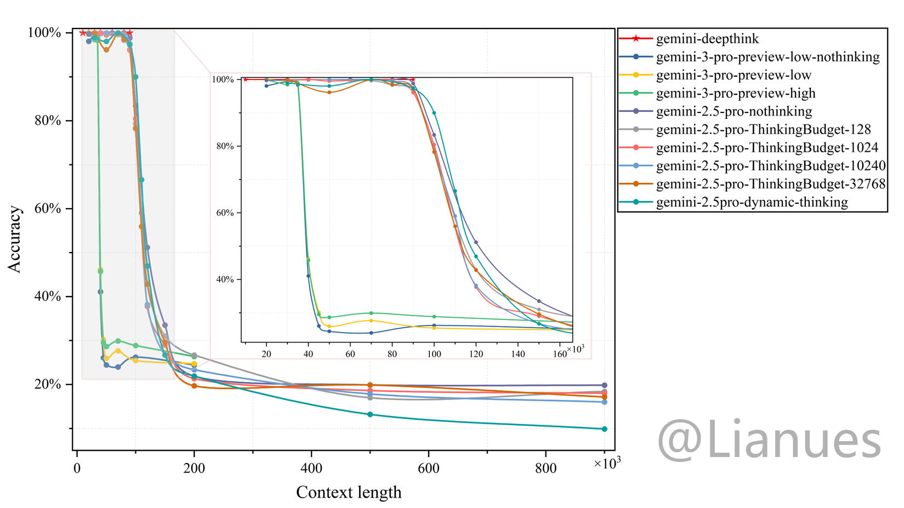

# LLM Recall Testing (Needle in a Haystack)

English | [简体中文](README_CN.md)

## Test Results
Below are the relevant test results:
### Gemini Full Context Window View


## Project Overview

This project tests the recall capabilities of mainstream large language models using a "needle in a haystack" methodology. This testing approach may correlate with the performance of model attention mechanisms to some extent.

### Tested Models

Primary models tested:
- **gemini-2.5-pro**
- **gemini-2.5-flash-preview-09-2025**
- **claude-sonnet-4-5-thinking**
- **DeepSeek_V3_0324**
- **gemini-deepthink**

Additionally, we tested recently popular hidden models:
- **lithiumflow**
- **orionmist**

⚠️ **Note**: Test data for all models except the hidden ones has been open-sourced and stored in the [`test_results/`](test_results/) directory.

## Testing Methodology

### Core Principle

The testing process follows these steps:

1. **Construct Test Text**: Randomly insert multiple four-digit numbers (1000-9999) into a fixed-token-length context
2. **Model Task**: Require the model to extract all four-digit numbers and output them in JSON format in order of appearance
3. **Scoring Algorithm**: Use an algorithm based on Edit Distance (Levenshtein Distance) to score model responses

### Scoring Algorithm

The scoring system is based on the **Edit Distance** algorithm and comprehensively evaluates model performance:

- ✅ **Penalizes extra keys** (Hallucination errors): Model outputs non-existent numbers
- ✅ **Penalizes missing keys** (Omission errors): Model misses numbers that should be extracted
- ✅ **Penalizes incorrect values**: Extracted number values are incorrect
- ✅ **Penalizes order errors**: Number sequence doesn't match the original text

**Accuracy Calculation Formula**:
```
Accuracy = (1 - Edit Distance / Max Sequence Length) × 100%
```

## Project Structure

```
.
├── 收集数据/                      # Data generation and collection module
│   ├── generate_text.py           # Generate test text
│   ├── run_batch_test.py          # Batch API testing script
│   ├── numbers.json               # Standard answers
│   ├── output.md                  # Generated test text
│   └── 数据库/                    # Test results database
│
├── 数据分析/                      # Data analysis module
│   ├── analyze_database.py        # Basic database analysis
│   ├── analyze_summary.py         # Model overview statistics
│   ├── analyze_errors.py          # Error type analysis (misorder/hallucination/missing)
│   ├── analyze_position_accuracy.py # Position accuracy analysis (LCS algorithm)
│   ├── create_heatmap.py          # Generate position accuracy heatmap
│   ├── create_hallucination_heatmap.py # Generate hallucination error heatmap
│   ├── create_missing_heatmap.py  # Generate missing error heatmap
│   ├── create_misorder_position_heatmap.py # Generate misorder heatmap
│   ├── generate_all_heatmaps.py   # Batch generate all heatmaps
│   ├── grading_utils.py           # Scoring utility functions
│   └── 分析结果/                  # Analysis results database
│
├── test_results/                  # Test results (classified by model)
│   ├── gemini-2.5-pro/
│   ├── gemini_2_5_flash_preview_09_2025/
│   ├── claude_sonnet_4_5_thinking/
│   ├── lithiumflow/
│   └── orionmist/
│
├── grading_utils.py               # Core scoring algorithm
├── evaluate_test.py               # Single test evaluation
├── 答案.json                      # Standard answer example
├── test.json                      # Test answer example
└── README.md                      # Project documentation
```

## Usage Guide

### 1. Generate Test Data

Use [`generate_text.py`](收集数据/generate_text.py) to generate test text:

```bash
cd 收集数据
python generate_text.py [context_length] [insertion_count]
```

**Parameters**:
- `context_length`: Base string length (default: 50000)
- `insertion_count`: Number of four-digit numbers to insert (default: 40)

**Example**:
```bash
python generate_text.py 30000 50  # Generate 30000 characters, insert 50 numbers
```

### 2. Batch Testing

Use [`run_batch_test.py`](收集数据/run_batch_test.py) for batch API testing:

```bash
cd 收集数据
python run_batch_test.py [runs] [concurrency] [delay] [context_length] [insertions] [base_pattern]
```

**Parameters**:
- `runs`: Number of test runs (default: 10)
- `concurrency`: Number of concurrent requests (default: 10)
- `delay`: Delay between requests in seconds (default: 0)
- `context_length`: Context byte count (default: 30000)
- `insertions`: Number of numbers to insert (default: 40)
- `base_pattern`: Base string pattern (default: `"a|"`)

**Example**:
```bash
python run_batch_test.py 20 5 1 30000 50  # 20 tests, 5 concurrent, 1 second delay
```

**Note**: Configuration required in the script:
- API URL (`API_URL`)
- Model ID (`MODEL_ID`)
- API Key (`HEADERS['authorization']`)

### 3. Data Analysis

#### Basic Statistical Analysis

```bash
python 数据分析/analyze_database.py <database_path>
```

#### Generate Model Overview

```bash
python 数据分析/analyze_summary.py <database_path>
```

#### Error Type Analysis

Analyze three types of errors (misorder, hallucination, missing):

```bash
python 数据分析/analyze_errors.py <database_path>
```

#### Position Accuracy Analysis

Analyze position accuracy using LCS (Longest Common Subsequence) algorithm:

```bash
python 数据分析/analyze_position_accuracy.py <database_path>
```

#### Generate Visualization Heatmaps

```bash
# Generate all heatmaps
python 数据分析/generate_all_heatmaps.py <database_path>

# Or generate individually
python 数据分析/create_heatmap.py <position_accuracy_database_path>
python 数据分析/create_hallucination_heatmap.py <error_stats_database_path>
python 数据分析/create_missing_heatmap.py <error_stats_database_path>
```

### 4. Evaluate Single Test

```bash
python evaluate_test.py
```

This command evaluates the accuracy of [`test.json`](test.json) relative to [`答案.json`](答案.json).

### Database Storage

Test results are stored in SQLite databases, separated by byte count:
- **Raw Data**: `bytes_{byte_count}` tables store raw test records
- **Statistical Summary**: `bytes_stats` table records answered count and parse failure count

### Analysis Results

Analysis results are stored in separate databases:
- **Model Overview**: `model_summary_{model_id}.db`
- **Error Statistics**: `error_stats_{model_id}.db`
- **Position Accuracy**: `position_accuracy_{model_id}.db`

### Visualization Charts

The project generates various visualization charts (stored in each model's `test_results/` subdirectory):
- 📊 **Average Accuracy Score Chart**: Shows average accuracy at different byte counts
- 🔥 **Position Accuracy Heatmap**: Shows correct answer probability at each position
- 🎯 **Hallucination Test Heatmap**: Shows distribution of hallucination errors
- 📉 **Missing Test Heatmap**: Shows distribution of missing errors
- 📈 **JSON Output Failure Probability Chart**: Shows probability distribution of parse failures
- 📑 **Statistical Tables**: Detailed statistics in Excel format

## Technical Features

### Error Analysis Methods

The project uses algorithms to analyze three types of errors:

1. **Misorder Errors**: Uses LCS algorithm to identify correctly ordered numbers as anchors; correct values not in anchors are misorders
2. **Hallucination Errors**: Identifies numbers output by the model that don't exist in standard answers, and locates their intervals between anchors
3. **Missing Errors**: Counts numbers present in standard answers but not correctly output by the model

### Position Accuracy Algorithm

Based on the **Longest Common Subsequence (LCS)** algorithm:
- Finds subsequences in model responses that are completely consistent with standard answer order
- Counts the frequency of correct identification at each position
- Generates position accuracy distribution charts

## Environment Requirements

### Python Dependencies

```bash
pip install aiohttp numpy matplotlib seaborn openpyxl
```

### Main Libraries
- `aiohttp`: Async HTTP requests
- `sqlite3`: Database operations (Python built-in)
- `numpy`: Numerical computation
- `matplotlib`: Chart plotting
- `seaborn`: Heatmap visualization
- `openpyxl`: Excel file operations

## Known Limitations

### ⚠️ Important Note: Scope of Test Results

**These tests only represent results from inserting needles within `a|` repetitive sequences.** In actual usage, model recall and attention are significantly influenced by the input text characteristics. Therefore, the accuracy measured in these tests **has comparative value only, not absolute value**.

**Do not directly apply these test results to claim that a model's recall and attention at a certain context length are limited to what these results show.** Different input content, text structures, and linguistic features can all significantly affect actual model performance.

**These tests are suitable for:**
- **Horizontal comparison**: Comparing different models under identical testing conditions
- **Longitudinal comparison**: Evaluating the same model's recall performance across different context window sizes

### DeepSeek Model Testing Notes

For DeepSeek models, since the **DeepSeek V3.1** version, a special attention mechanism has been introduced internally. This causes the test results to be inaccurate when using the simple `a|` pattern — specifically, it shows **abnormally high accuracy across the entire context range, which is not normal behavior**.

When we changed the insertion pattern and stopped using the simple `a|` repetition, DeepSeek models showed drastically different results. This suggests that the model may have special optimizations for specific repetitive patterns.

**Future Plans**: We will create a revised version of the test set to more accurately evaluate models with special attention mechanisms, including DeepSeek.

### GPT-5 Model Testing Notes

Additionally, we tested the **GPT-5** model. However, GPT-5 uses an internal **model routing mechanism** that causes severe instability issues:

- In the same context (50k tokens) tests, accuracy distribution is extremely unstable, **ranging wildly from 5% to 100%**
- 100% accuracy likely indicates routing to the best model in the ensemble, but this cannot be reliably reproduced
- We attempted various methods to stabilize routing results, including:
  - Modifying prompt content
  - Adjusting thinking intensity settings (even when set to `high`)
  - Various other optimization strategies

**Test Conclusion**: Due to the inability to obtain stable and reproducible test results, GPT-5 model test sets will not be publicly released at this time. We will publish the test set once better testing methodologies are developed.

## Citation

If this project helps your research, citations are welcome!

---

**Last Updated**: 2025.11.01
